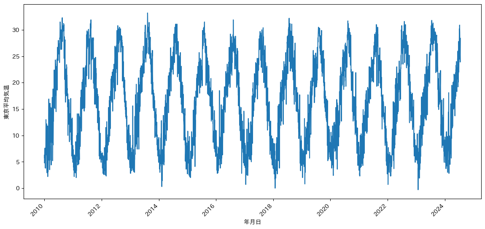
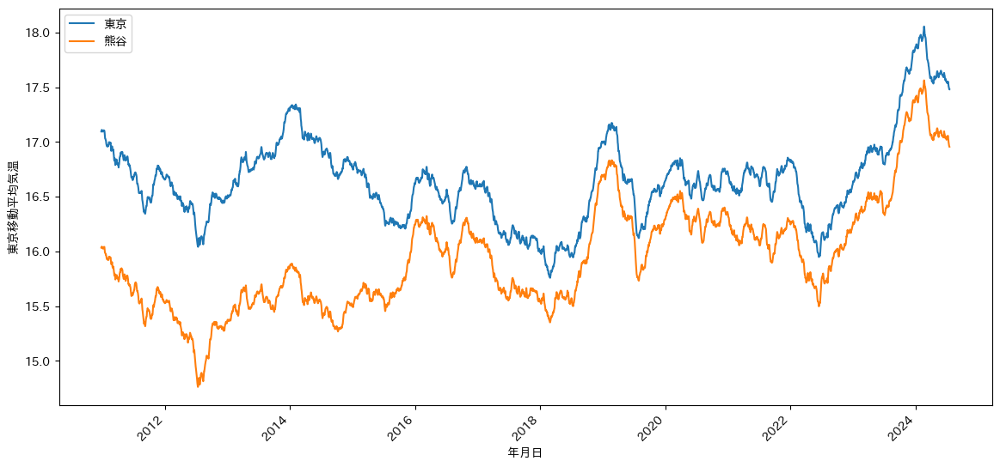
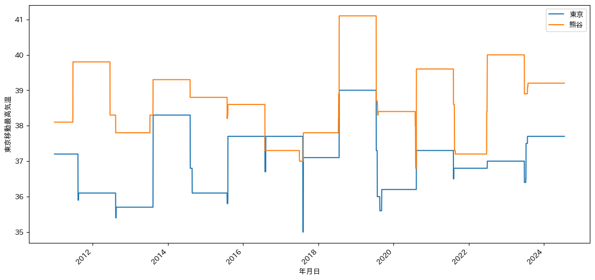

# 時系列データ
1. 表形式のデータとは異なり、行方向に時間情報がついたようなデータ形式。
2. 気温の変化、株価の変化、経済成長、流行・ブームなど、時間とともに変化するデータが対象
3. 一般に折れ線グラフで可視化する

   例：気象庁の過去の気温データ
   https://www.data.jma.go.jp/risk/obsdl/index.php


```python
import pandas as pd
temp_series = pd.read_csv('temprature_series.csv',encoding='ms932', sep=',',skiprows=0  , parse_dates=['年月日'])
temp_series
```


<div>
<style scoped>
    .dataframe tbody tr th:only-of-type {
        vertical-align: middle;
    }

    .dataframe tbody tr th {
        vertical-align: top;
    }

    .dataframe thead th {
        text-align: right;
    }
</style>
<table border="1" class="dataframe">
  <thead>
    <tr style="text-align: right;">
      <th></th>
      <th>年月日</th>
      <th>東京平均気温</th>
      <th>東京最高気温</th>
      <th>さいたま平均気温</th>
      <th>さいたま最高気温</th>
      <th>熊谷平均気温</th>
      <th>熊谷最高気温</th>
      <th>前橋平均気温</th>
      <th>前橋最高気温</th>
      <th>沼田平均気温</th>
      <th>沼田最高気温</th>
    </tr>
  </thead>
  <tbody>
    <tr>
      <th>0</th>
      <td>2010-01-01</td>
      <td>4.8</td>
      <td>9.5</td>
      <td>2.4</td>
      <td>8.4</td>
      <td>3.0</td>
      <td>7.8</td>
      <td>1.5</td>
      <td>6.8</td>
      <td>-1.9</td>
      <td>0.7</td>
    </tr>
    <tr>
      <th>1</th>
      <td>2010-01-02</td>
      <td>6.3</td>
      <td>11.4</td>
      <td>4.1</td>
      <td>11.4</td>
      <td>5.4</td>
      <td>11.4</td>
      <td>3.7</td>
      <td>9.4</td>
      <td>0.5</td>
      <td>5.0</td>
    </tr>
    <tr>
      <th>2</th>
      <td>2010-01-03</td>
      <td>5.7</td>
      <td>9.2</td>
      <td>3.2</td>
      <td>9.4</td>
      <td>3.4</td>
      <td>10.5</td>
      <td>3.5</td>
      <td>8.1</td>
      <td>0.1</td>
      <td>4.1</td>
    </tr>
    <tr>
      <th>3</th>
      <td>2010-01-04</td>
      <td>6.5</td>
      <td>9.6</td>
      <td>3.8</td>
      <td>8.8</td>
      <td>4.4</td>
      <td>9.5</td>
      <td>3.5</td>
      <td>9.5</td>
      <td>0.8</td>
      <td>5.8</td>
    </tr>
    <tr>
      <th>4</th>
      <td>2010-01-05</td>
      <td>7.3</td>
      <td>13.2</td>
      <td>5.2</td>
      <td>13.4</td>
      <td>5.3</td>
      <td>13.3</td>
      <td>4.8</td>
      <td>11.5</td>
      <td>0.7</td>
      <td>5.8</td>
    </tr>
    <tr>
      <th>...</th>
      <td>...</td>
      <td>...</td>
      <td>...</td>
      <td>...</td>
      <td>...</td>
      <td>...</td>
      <td>...</td>
      <td>...</td>
      <td>...</td>
      <td>...</td>
      <td>...</td>
    </tr>
    <tr>
      <th>5308</th>
      <td>2024-07-14</td>
      <td>25.4</td>
      <td>28.8</td>
      <td>24.9</td>
      <td>27.1</td>
      <td>23.8</td>
      <td>25.0</td>
      <td>23.9</td>
      <td>25.6</td>
      <td>22.6</td>
      <td>26.9</td>
    </tr>
    <tr>
      <th>5309</th>
      <td>2024-07-15</td>
      <td>24.6</td>
      <td>27.7</td>
      <td>24.3</td>
      <td>27.3</td>
      <td>24.2</td>
      <td>27.1</td>
      <td>24.0</td>
      <td>26.2</td>
      <td>22.4</td>
      <td>25.5</td>
    </tr>
    <tr>
      <th>5310</th>
      <td>2024-07-16</td>
      <td>23.9</td>
      <td>27.3</td>
      <td>23.7</td>
      <td>26.2</td>
      <td>22.9</td>
      <td>24.3</td>
      <td>22.1</td>
      <td>23.5</td>
      <td>20.8</td>
      <td>21.9</td>
    </tr>
    <tr>
      <th>5311</th>
      <td>2024-07-17</td>
      <td>25.8</td>
      <td>31.3</td>
      <td>26.4</td>
      <td>32.3</td>
      <td>26.4</td>
      <td>31.6</td>
      <td>26.3</td>
      <td>31.6</td>
      <td>23.3</td>
      <td>29.4</td>
    </tr>
    <tr>
      <th>5312</th>
      <td>2024-07-18</td>
      <td>28.4</td>
      <td>33.4</td>
      <td>28.8</td>
      <td>34.5</td>
      <td>28.4</td>
      <td>33.6</td>
      <td>28.3</td>
      <td>33.3</td>
      <td>25.0</td>
      <td>32.6</td>
    </tr>
  </tbody>
</table>
<p>5313 rows × 11 columns</p>
</div>


## 東京の2010~2024の日次平均気温の時系列


```python
import seaborn as sns
from matplotlib import pyplot as plt
from matplotlib.pyplot import figure
import japanize_matplotlib

figure(figsize=(14, 6))
sns.lineplot(data=temp_series,x='年月日',y='東京平均気温')
plt.xticks(rotation=45,ha='right')
```


    (array([13879., 14610., 15340., 16071., 16801., 17532., 18262., 18993.,
            19723., 20454.]),
     [Text(13879.0, 0, '2008'),
      Text(14610.0, 0, '2010'),
      Text(15340.0, 0, '2012'),
      Text(16071.0, 0, '2014'),
      Text(16801.0, 0, '2016'),
      Text(17532.0, 0, '2018'),
      Text(18262.0, 0, '2020'),
      Text(18993.0, 0, '2022'),
      Text(19723.0, 0, '2024'),
      Text(20454.0, 0, '2026')])


    

    


# 時系列データのためのデータ型：datetime型(timedelta型を含む）
1. 日付の演算ができる。例えば20220720の1か月後と20220620の1か月後は、大小の月を加味する必要がある
2. timezoneの変換（つまり時差の自動計算）
3. 大小比較、ソート（2022-12-1 と 2022-1-31 の大小関係など、表示形式によって大小比較が難しい場合がある）
4. いろいろな表示形式の編集　2022/7/30 -> 20220730 とか  

参考リンク　 https://python.softmoco.com/basics/python-datetime.php

# 1. datetime型の演算

**例1. 時刻の和差の計算**  
https://qiita.com/dkugi/items/8c32cc481b365c277ec2  
- datatime型の日付の和・差を計算するだけで計算ができる
- 数値型として日付の演算をするとかなり面倒


```python
import datetime
print(datetime.date(2025, 9, 15))
```

    2025-09-15
    


```python
date1 = datetime.date(2024, 10, 15)
date2 = datetime.date(2024, 7, 15)
print(date1 - date2)
```

    92 days, 0:00:00
    


```python
date2 + datetime.timedelta(days=92)
```


    datetime.date(2024, 10, 15)


```python
date2 + datetime.timedelta(weeks=13)
```


    datetime.date(2024, 10, 14)


```python
from dateutil.relativedelta import relativedelta
data2 + relativedelta(months=3)
```


    datetime.date(2024, 10, 15)


**例2. 日付の配列を作る**
https://note.nkmk.me/python-datetime-usage/


```python
date3 = datetime.date(2024, 7, 1)
d = datetime.timedelta(days=1)
n = 10
l = [(date3 + i * d) for i in range(n)]
print(l)
```

    [datetime.date(2024, 7, 1), datetime.date(2024, 7, 2), datetime.date(2024, 7, 3), datetime.date(2024, 7, 4), datetime.date(2024, 7, 5), datetime.date(2024, 7, 6), datetime.date(2024, 7, 7), datetime.date(2024, 7, 8), datetime.date(2024, 7, 9), datetime.date(2024, 7, 10)]
    


```python
w = datetime.timedelta(weeks=2)
n = 4
l = [(date3 + i * w) for i in range(n)]
print(l)
```

    [datetime.date(2024, 7, 1), datetime.date(2024, 7, 15), datetime.date(2024, 7, 29), datetime.date(2024, 8, 12)]
    

**例3. 秒単位での計算もできる**


```python
ymdhms1 = datetime.datetime(2024, 10, 15, 14, 35, 22)
ymdhms2 = datetime.datetime(2024, 7, 15, 20, 1, 10)
ymdhms1 - ymdhms2
```


    datetime.timedelta(days=91, seconds=66852)


# 演習1. 日付の配列を作る
1. 2024.7.24から１ヵ月毎に1年後までの配列を、上記　例2にならって作成せよ
2. この配列から、隣り合う日付間の日数を計算して配列にせよ


```python

```

    [datetime.date(2024, 7, 24), datetime.date(2024, 8, 24), datetime.date(2024, 9, 24), datetime.date(2024, 10, 24), datetime.date(2024, 11, 24), datetime.date(2024, 12, 24), datetime.date(2025, 1, 24), datetime.date(2025, 2, 24), datetime.date(2025, 3, 24), datetime.date(2025, 4, 24), datetime.date(2025, 5, 24), datetime.date(2025, 6, 24)]
    


```python
days = [ l[i+1] - l[i] for i in range(11)]
days
```


    [datetime.timedelta(days=31),
     datetime.timedelta(days=31),
     datetime.timedelta(days=30),
     datetime.timedelta(days=31),
     datetime.timedelta(days=30),
     datetime.timedelta(days=31),
     datetime.timedelta(days=31),
     datetime.timedelta(days=28),
     datetime.timedelta(days=31),
     datetime.timedelta(days=30),
     datetime.timedelta(days=31)]


# 2. 日付の表示形式を編集する

**例1. 年月だけを取り出す**


```python
date2.year
```


    2024


```python
date2.month
```


    7


```python
datetime.date(date2.year,date2.month,1)
```


    datetime.date(2024, 7, 1)


```python
date2.day
```


    15


hour minutes second を取り出す


```python
ymdhms2.time()
```


    datetime.time(20, 1, 10)


**例2. datatime型を文字列に変換**  
- 文字列に変換する際に様々な表示形式にする 
- 曜日を表示することもできる

### 構文
---

```python
datetime型変数.strftime(書式コード)
```
書式コードは以下を参照  
https://note.nkmk.me/python-datetime-usage/

---

文字列をdatetime型に変換することもできる。  
参考：https://note.nkmk.me/python-datetime-usage/


```python
date1 = datetime.date(2024, 10, 15)
print(data1.strftime('%Y/%m/%d'))
print(data1.strftime('%Y-%m-%d'))
print(data1.strftime('%y/%m/%d'))
print(data1.strftime('%A, %B %d, %Y'))
ymdhms1 = datetime.datetime(2024, 10, 15, 14, 35, 22)
print(ymdhms1.strftime('%Y/%m/%d %H:%M:%S.%f'))
```

    2024/10/15
    2024-10-15
    24/10/15
    Tuesday, October 15, 2024
    2024/10/15 14:35:22.000000
    

# 演習2. 月日の表示  

1. 2024.7.22を以下の２通りに表示せよ
- 07月22日
- July 22  

2.上記07月22日は文字列。この月日だけで再びdatetime型に変換せよ。文字列→datetime型の変換は以下の「strptime(): 文字列から日付・時間への変換」を参照
  https://note.nkmk.me/python-datetime-usage/


```python
date10 = datetime.date(2024, 7, 22)
```

    07月22日
    July 22
    


```python

```

    1900-07-22 00:00:00
    

# 3. DataFrame 時系列データを扱う
DataFrame 時系列データとは、タイムスタンプの列がついたデータ。以下の手順え処理する
1. DataFrameのタイムスタンプ列をdatetime型に変換
2. datetime型をソート
3. 時系列データに演算処理を加える
    
**例1. DataFrameのタイムスタンプ列をdatetime型にする**  
dataframeに読み込む際に、parse_dates=['年月日']のように指定すると、年月日の列が一括してdaetime型に変換される


```python

import pandas as pd
temp_series = pd.read_csv('temprature_series.csv',encoding='ms932', sep=',',skiprows=0  , parse_dates=['年月日'])
temp_series
```


<div>
<style scoped>
    .dataframe tbody tr th:only-of-type {
        vertical-align: middle;
    }

    .dataframe tbody tr th {
        vertical-align: top;
    }

    .dataframe thead th {
        text-align: right;
    }
</style>
<table border="1" class="dataframe">
  <thead>
    <tr style="text-align: right;">
      <th></th>
      <th>年月日</th>
      <th>東京平均気温</th>
      <th>東京最高気温</th>
      <th>さいたま平均気温</th>
      <th>さいたま最高気温</th>
      <th>熊谷平均気温</th>
      <th>熊谷最高気温</th>
      <th>前橋平均気温</th>
      <th>前橋最高気温</th>
      <th>沼田平均気温</th>
      <th>沼田最高気温</th>
    </tr>
  </thead>
  <tbody>
    <tr>
      <th>0</th>
      <td>2010-01-01</td>
      <td>4.8</td>
      <td>9.5</td>
      <td>2.4</td>
      <td>8.4</td>
      <td>3.0</td>
      <td>7.8</td>
      <td>1.5</td>
      <td>6.8</td>
      <td>-1.9</td>
      <td>0.7</td>
    </tr>
    <tr>
      <th>1</th>
      <td>2010-01-02</td>
      <td>6.3</td>
      <td>11.4</td>
      <td>4.1</td>
      <td>11.4</td>
      <td>5.4</td>
      <td>11.4</td>
      <td>3.7</td>
      <td>9.4</td>
      <td>0.5</td>
      <td>5.0</td>
    </tr>
    <tr>
      <th>2</th>
      <td>2010-01-03</td>
      <td>5.7</td>
      <td>9.2</td>
      <td>3.2</td>
      <td>9.4</td>
      <td>3.4</td>
      <td>10.5</td>
      <td>3.5</td>
      <td>8.1</td>
      <td>0.1</td>
      <td>4.1</td>
    </tr>
    <tr>
      <th>3</th>
      <td>2010-01-04</td>
      <td>6.5</td>
      <td>9.6</td>
      <td>3.8</td>
      <td>8.8</td>
      <td>4.4</td>
      <td>9.5</td>
      <td>3.5</td>
      <td>9.5</td>
      <td>0.8</td>
      <td>5.8</td>
    </tr>
    <tr>
      <th>4</th>
      <td>2010-01-05</td>
      <td>7.3</td>
      <td>13.2</td>
      <td>5.2</td>
      <td>13.4</td>
      <td>5.3</td>
      <td>13.3</td>
      <td>4.8</td>
      <td>11.5</td>
      <td>0.7</td>
      <td>5.8</td>
    </tr>
    <tr>
      <th>...</th>
      <td>...</td>
      <td>...</td>
      <td>...</td>
      <td>...</td>
      <td>...</td>
      <td>...</td>
      <td>...</td>
      <td>...</td>
      <td>...</td>
      <td>...</td>
      <td>...</td>
    </tr>
    <tr>
      <th>5308</th>
      <td>2024-07-14</td>
      <td>25.4</td>
      <td>28.8</td>
      <td>24.9</td>
      <td>27.1</td>
      <td>23.8</td>
      <td>25.0</td>
      <td>23.9</td>
      <td>25.6</td>
      <td>22.6</td>
      <td>26.9</td>
    </tr>
    <tr>
      <th>5309</th>
      <td>2024-07-15</td>
      <td>24.6</td>
      <td>27.7</td>
      <td>24.3</td>
      <td>27.3</td>
      <td>24.2</td>
      <td>27.1</td>
      <td>24.0</td>
      <td>26.2</td>
      <td>22.4</td>
      <td>25.5</td>
    </tr>
    <tr>
      <th>5310</th>
      <td>2024-07-16</td>
      <td>23.9</td>
      <td>27.3</td>
      <td>23.7</td>
      <td>26.2</td>
      <td>22.9</td>
      <td>24.3</td>
      <td>22.1</td>
      <td>23.5</td>
      <td>20.8</td>
      <td>21.9</td>
    </tr>
    <tr>
      <th>5311</th>
      <td>2024-07-17</td>
      <td>25.8</td>
      <td>31.3</td>
      <td>26.4</td>
      <td>32.3</td>
      <td>26.4</td>
      <td>31.6</td>
      <td>26.3</td>
      <td>31.6</td>
      <td>23.3</td>
      <td>29.4</td>
    </tr>
    <tr>
      <th>5312</th>
      <td>2024-07-18</td>
      <td>28.4</td>
      <td>33.4</td>
      <td>28.8</td>
      <td>34.5</td>
      <td>28.4</td>
      <td>33.6</td>
      <td>28.3</td>
      <td>33.3</td>
      <td>25.0</td>
      <td>32.6</td>
    </tr>
  </tbody>
</table>
<p>5313 rows × 11 columns</p>
</div>


**確かにdatetime型になっている**


```python
print(temp_series['年月日'][5]-temp_series['年月日'][0])
```

    5 days 00:00:00
    

**例1. (2)DataFrameを読み込んだ後でdatatime型に変換することもできる**  
https://qiita.com/odacoh/items/1c3f5b159c4ffd92665c


```python
import pandas as pd
temp_series = pd.read_csv('temprature_series.csv',encoding='ms932', sep=',',skiprows=0 )
temp_series['年月日'] =  pd.to_datetime(temp_series['年月日'])
temp_series
```


<div>
<style scoped>
    .dataframe tbody tr th:only-of-type {
        vertical-align: middle;
    }

    .dataframe tbody tr th {
        vertical-align: top;
    }

    .dataframe thead th {
        text-align: right;
    }
</style>
<table border="1" class="dataframe">
  <thead>
    <tr style="text-align: right;">
      <th></th>
      <th>年月日</th>
      <th>東京平均気温</th>
      <th>東京最高気温</th>
      <th>さいたま平均気温</th>
      <th>さいたま最高気温</th>
      <th>熊谷平均気温</th>
      <th>熊谷最高気温</th>
      <th>前橋平均気温</th>
      <th>前橋最高気温</th>
      <th>沼田平均気温</th>
      <th>沼田最高気温</th>
    </tr>
  </thead>
  <tbody>
    <tr>
      <th>0</th>
      <td>2010-01-01</td>
      <td>4.8</td>
      <td>9.5</td>
      <td>2.4</td>
      <td>8.4</td>
      <td>3.0</td>
      <td>7.8</td>
      <td>1.5</td>
      <td>6.8</td>
      <td>-1.9</td>
      <td>0.7</td>
    </tr>
    <tr>
      <th>1</th>
      <td>2010-01-02</td>
      <td>6.3</td>
      <td>11.4</td>
      <td>4.1</td>
      <td>11.4</td>
      <td>5.4</td>
      <td>11.4</td>
      <td>3.7</td>
      <td>9.4</td>
      <td>0.5</td>
      <td>5.0</td>
    </tr>
    <tr>
      <th>2</th>
      <td>2010-01-03</td>
      <td>5.7</td>
      <td>9.2</td>
      <td>3.2</td>
      <td>9.4</td>
      <td>3.4</td>
      <td>10.5</td>
      <td>3.5</td>
      <td>8.1</td>
      <td>0.1</td>
      <td>4.1</td>
    </tr>
    <tr>
      <th>3</th>
      <td>2010-01-04</td>
      <td>6.5</td>
      <td>9.6</td>
      <td>3.8</td>
      <td>8.8</td>
      <td>4.4</td>
      <td>9.5</td>
      <td>3.5</td>
      <td>9.5</td>
      <td>0.8</td>
      <td>5.8</td>
    </tr>
    <tr>
      <th>4</th>
      <td>2010-01-05</td>
      <td>7.3</td>
      <td>13.2</td>
      <td>5.2</td>
      <td>13.4</td>
      <td>5.3</td>
      <td>13.3</td>
      <td>4.8</td>
      <td>11.5</td>
      <td>0.7</td>
      <td>5.8</td>
    </tr>
    <tr>
      <th>...</th>
      <td>...</td>
      <td>...</td>
      <td>...</td>
      <td>...</td>
      <td>...</td>
      <td>...</td>
      <td>...</td>
      <td>...</td>
      <td>...</td>
      <td>...</td>
      <td>...</td>
    </tr>
    <tr>
      <th>5308</th>
      <td>2024-07-14</td>
      <td>25.4</td>
      <td>28.8</td>
      <td>24.9</td>
      <td>27.1</td>
      <td>23.8</td>
      <td>25.0</td>
      <td>23.9</td>
      <td>25.6</td>
      <td>22.6</td>
      <td>26.9</td>
    </tr>
    <tr>
      <th>5309</th>
      <td>2024-07-15</td>
      <td>24.6</td>
      <td>27.7</td>
      <td>24.3</td>
      <td>27.3</td>
      <td>24.2</td>
      <td>27.1</td>
      <td>24.0</td>
      <td>26.2</td>
      <td>22.4</td>
      <td>25.5</td>
    </tr>
    <tr>
      <th>5310</th>
      <td>2024-07-16</td>
      <td>23.9</td>
      <td>27.3</td>
      <td>23.7</td>
      <td>26.2</td>
      <td>22.9</td>
      <td>24.3</td>
      <td>22.1</td>
      <td>23.5</td>
      <td>20.8</td>
      <td>21.9</td>
    </tr>
    <tr>
      <th>5311</th>
      <td>2024-07-17</td>
      <td>25.8</td>
      <td>31.3</td>
      <td>26.4</td>
      <td>32.3</td>
      <td>26.4</td>
      <td>31.6</td>
      <td>26.3</td>
      <td>31.6</td>
      <td>23.3</td>
      <td>29.4</td>
    </tr>
    <tr>
      <th>5312</th>
      <td>2024-07-18</td>
      <td>28.4</td>
      <td>33.4</td>
      <td>28.8</td>
      <td>34.5</td>
      <td>28.4</td>
      <td>33.6</td>
      <td>28.3</td>
      <td>33.3</td>
      <td>25.0</td>
      <td>32.6</td>
    </tr>
  </tbody>
</table>
<p>5313 rows × 11 columns</p>
</div>


**例2. 年月日の列を月に変換**


```python
temp_series["年月"] = temp_series['年月日'].dt.to_period("M")

```

**例3. 年月日を年に変換**  
https://datatechlog.com/how_to_translate_yyyymmdd_to_yyyymm/


```python
temp_series["年"] = temp_series['年月日'].dt.to_period("Y")
temp_series

```


<div>
<style scoped>
    .dataframe tbody tr th:only-of-type {
        vertical-align: middle;
    }

    .dataframe tbody tr th {
        vertical-align: top;
    }

    .dataframe thead th {
        text-align: right;
    }
</style>
<table border="1" class="dataframe">
  <thead>
    <tr style="text-align: right;">
      <th></th>
      <th>年月日</th>
      <th>東京平均気温</th>
      <th>東京最高気温</th>
      <th>さいたま平均気温</th>
      <th>さいたま最高気温</th>
      <th>熊谷平均気温</th>
      <th>熊谷最高気温</th>
      <th>前橋平均気温</th>
      <th>前橋最高気温</th>
      <th>沼田平均気温</th>
      <th>沼田最高気温</th>
      <th>月</th>
      <th>年</th>
      <th>東京移動平均気温</th>
      <th>年月</th>
    </tr>
  </thead>
  <tbody>
    <tr>
      <th>0</th>
      <td>2010-01-01</td>
      <td>4.8</td>
      <td>9.5</td>
      <td>2.4</td>
      <td>8.4</td>
      <td>3.0</td>
      <td>7.8</td>
      <td>1.5</td>
      <td>6.8</td>
      <td>-1.9</td>
      <td>0.7</td>
      <td>2010-01</td>
      <td>2010</td>
      <td>NaN</td>
      <td>2010-01</td>
    </tr>
    <tr>
      <th>1</th>
      <td>2010-01-02</td>
      <td>6.3</td>
      <td>11.4</td>
      <td>4.1</td>
      <td>11.4</td>
      <td>5.4</td>
      <td>11.4</td>
      <td>3.7</td>
      <td>9.4</td>
      <td>0.5</td>
      <td>5.0</td>
      <td>2010-01</td>
      <td>2010</td>
      <td>NaN</td>
      <td>2010-01</td>
    </tr>
    <tr>
      <th>2</th>
      <td>2010-01-03</td>
      <td>5.7</td>
      <td>9.2</td>
      <td>3.2</td>
      <td>9.4</td>
      <td>3.4</td>
      <td>10.5</td>
      <td>3.5</td>
      <td>8.1</td>
      <td>0.1</td>
      <td>4.1</td>
      <td>2010-01</td>
      <td>2010</td>
      <td>NaN</td>
      <td>2010-01</td>
    </tr>
    <tr>
      <th>3</th>
      <td>2010-01-04</td>
      <td>6.5</td>
      <td>9.6</td>
      <td>3.8</td>
      <td>8.8</td>
      <td>4.4</td>
      <td>9.5</td>
      <td>3.5</td>
      <td>9.5</td>
      <td>0.8</td>
      <td>5.8</td>
      <td>2010-01</td>
      <td>2010</td>
      <td>NaN</td>
      <td>2010-01</td>
    </tr>
    <tr>
      <th>4</th>
      <td>2010-01-05</td>
      <td>7.3</td>
      <td>13.2</td>
      <td>5.2</td>
      <td>13.4</td>
      <td>5.3</td>
      <td>13.3</td>
      <td>4.8</td>
      <td>11.5</td>
      <td>0.7</td>
      <td>5.8</td>
      <td>2010-01</td>
      <td>2010</td>
      <td>NaN</td>
      <td>2010-01</td>
    </tr>
    <tr>
      <th>...</th>
      <td>...</td>
      <td>...</td>
      <td>...</td>
      <td>...</td>
      <td>...</td>
      <td>...</td>
      <td>...</td>
      <td>...</td>
      <td>...</td>
      <td>...</td>
      <td>...</td>
      <td>...</td>
      <td>...</td>
      <td>...</td>
      <td>...</td>
    </tr>
    <tr>
      <th>5308</th>
      <td>2024-07-14</td>
      <td>25.4</td>
      <td>28.8</td>
      <td>24.9</td>
      <td>27.1</td>
      <td>23.8</td>
      <td>25.0</td>
      <td>23.9</td>
      <td>25.6</td>
      <td>22.6</td>
      <td>26.9</td>
      <td>2024-07</td>
      <td>2024</td>
      <td>17.503056</td>
      <td>2024-07</td>
    </tr>
    <tr>
      <th>5309</th>
      <td>2024-07-15</td>
      <td>24.6</td>
      <td>27.7</td>
      <td>24.3</td>
      <td>27.3</td>
      <td>24.2</td>
      <td>27.1</td>
      <td>24.0</td>
      <td>26.2</td>
      <td>22.4</td>
      <td>25.5</td>
      <td>2024-07</td>
      <td>2024</td>
      <td>17.495833</td>
      <td>2024-07</td>
    </tr>
    <tr>
      <th>5310</th>
      <td>2024-07-16</td>
      <td>23.9</td>
      <td>27.3</td>
      <td>23.7</td>
      <td>26.2</td>
      <td>22.9</td>
      <td>24.3</td>
      <td>22.1</td>
      <td>23.5</td>
      <td>20.8</td>
      <td>21.9</td>
      <td>2024-07</td>
      <td>2024</td>
      <td>17.486667</td>
      <td>2024-07</td>
    </tr>
    <tr>
      <th>5311</th>
      <td>2024-07-17</td>
      <td>25.8</td>
      <td>31.3</td>
      <td>26.4</td>
      <td>32.3</td>
      <td>26.4</td>
      <td>31.6</td>
      <td>26.3</td>
      <td>31.6</td>
      <td>23.3</td>
      <td>29.4</td>
      <td>2024-07</td>
      <td>2024</td>
      <td>17.481389</td>
      <td>2024-07</td>
    </tr>
    <tr>
      <th>5312</th>
      <td>2024-07-18</td>
      <td>28.4</td>
      <td>33.4</td>
      <td>28.8</td>
      <td>34.5</td>
      <td>28.4</td>
      <td>33.6</td>
      <td>28.3</td>
      <td>33.3</td>
      <td>25.0</td>
      <td>32.6</td>
      <td>2024-07</td>
      <td>2024</td>
      <td>17.481111</td>
      <td>2024-07</td>
    </tr>
  </tbody>
</table>
<p>5313 rows × 15 columns</p>
</div>


**例5. 日付のソート**


```python
	
# 降順でソート
temp_sorted = temp_series.sort_values('年月日', ascending=False)
temp_sorted
```


<div>
<style scoped>
    .dataframe tbody tr th:only-of-type {
        vertical-align: middle;
    }

    .dataframe tbody tr th {
        vertical-align: top;
    }

    .dataframe thead th {
        text-align: right;
    }
</style>
<table border="1" class="dataframe">
  <thead>
    <tr style="text-align: right;">
      <th></th>
      <th>年月日</th>
      <th>東京平均気温</th>
      <th>東京最高気温</th>
      <th>さいたま平均気温</th>
      <th>さいたま最高気温</th>
      <th>熊谷平均気温</th>
      <th>熊谷最高気温</th>
      <th>前橋平均気温</th>
      <th>前橋最高気温</th>
      <th>沼田平均気温</th>
      <th>沼田最高気温</th>
      <th>月</th>
      <th>年</th>
    </tr>
  </thead>
  <tbody>
    <tr>
      <th>5312</th>
      <td>2024-07-18</td>
      <td>28.4</td>
      <td>33.4</td>
      <td>28.8</td>
      <td>34.5</td>
      <td>28.4</td>
      <td>33.6</td>
      <td>28.3</td>
      <td>33.3</td>
      <td>25.0</td>
      <td>32.6</td>
      <td>2024-07</td>
      <td>2024</td>
    </tr>
    <tr>
      <th>5311</th>
      <td>2024-07-17</td>
      <td>25.8</td>
      <td>31.3</td>
      <td>26.4</td>
      <td>32.3</td>
      <td>26.4</td>
      <td>31.6</td>
      <td>26.3</td>
      <td>31.6</td>
      <td>23.3</td>
      <td>29.4</td>
      <td>2024-07</td>
      <td>2024</td>
    </tr>
    <tr>
      <th>5310</th>
      <td>2024-07-16</td>
      <td>23.9</td>
      <td>27.3</td>
      <td>23.7</td>
      <td>26.2</td>
      <td>22.9</td>
      <td>24.3</td>
      <td>22.1</td>
      <td>23.5</td>
      <td>20.8</td>
      <td>21.9</td>
      <td>2024-07</td>
      <td>2024</td>
    </tr>
    <tr>
      <th>5309</th>
      <td>2024-07-15</td>
      <td>24.6</td>
      <td>27.7</td>
      <td>24.3</td>
      <td>27.3</td>
      <td>24.2</td>
      <td>27.1</td>
      <td>24.0</td>
      <td>26.2</td>
      <td>22.4</td>
      <td>25.5</td>
      <td>2024-07</td>
      <td>2024</td>
    </tr>
    <tr>
      <th>5308</th>
      <td>2024-07-14</td>
      <td>25.4</td>
      <td>28.8</td>
      <td>24.9</td>
      <td>27.1</td>
      <td>23.8</td>
      <td>25.0</td>
      <td>23.9</td>
      <td>25.6</td>
      <td>22.6</td>
      <td>26.9</td>
      <td>2024-07</td>
      <td>2024</td>
    </tr>
    <tr>
      <th>...</th>
      <td>...</td>
      <td>...</td>
      <td>...</td>
      <td>...</td>
      <td>...</td>
      <td>...</td>
      <td>...</td>
      <td>...</td>
      <td>...</td>
      <td>...</td>
      <td>...</td>
      <td>...</td>
      <td>...</td>
    </tr>
    <tr>
      <th>4</th>
      <td>2010-01-05</td>
      <td>7.3</td>
      <td>13.2</td>
      <td>5.2</td>
      <td>13.4</td>
      <td>5.3</td>
      <td>13.3</td>
      <td>4.8</td>
      <td>11.5</td>
      <td>0.7</td>
      <td>5.8</td>
      <td>2010-01</td>
      <td>2010</td>
    </tr>
    <tr>
      <th>3</th>
      <td>2010-01-04</td>
      <td>6.5</td>
      <td>9.6</td>
      <td>3.8</td>
      <td>8.8</td>
      <td>4.4</td>
      <td>9.5</td>
      <td>3.5</td>
      <td>9.5</td>
      <td>0.8</td>
      <td>5.8</td>
      <td>2010-01</td>
      <td>2010</td>
    </tr>
    <tr>
      <th>2</th>
      <td>2010-01-03</td>
      <td>5.7</td>
      <td>9.2</td>
      <td>3.2</td>
      <td>9.4</td>
      <td>3.4</td>
      <td>10.5</td>
      <td>3.5</td>
      <td>8.1</td>
      <td>0.1</td>
      <td>4.1</td>
      <td>2010-01</td>
      <td>2010</td>
    </tr>
    <tr>
      <th>1</th>
      <td>2010-01-02</td>
      <td>6.3</td>
      <td>11.4</td>
      <td>4.1</td>
      <td>11.4</td>
      <td>5.4</td>
      <td>11.4</td>
      <td>3.7</td>
      <td>9.4</td>
      <td>0.5</td>
      <td>5.0</td>
      <td>2010-01</td>
      <td>2010</td>
    </tr>
    <tr>
      <th>0</th>
      <td>2010-01-01</td>
      <td>4.8</td>
      <td>9.5</td>
      <td>2.4</td>
      <td>8.4</td>
      <td>3.0</td>
      <td>7.8</td>
      <td>1.5</td>
      <td>6.8</td>
      <td>-1.9</td>
      <td>0.7</td>
      <td>2010-01</td>
      <td>2010</td>
    </tr>
  </tbody>
</table>
<p>5313 rows × 13 columns</p>
</div>


**例6. 月でソートする**  
年にかかわらず月でまとめられるので、例えば10年分の月毎の推移を分析できる


```python
temp_sorted = temp_series.sort_values('月')
temp_sorted
```


<div>
<style scoped>
    .dataframe tbody tr th:only-of-type {
        vertical-align: middle;
    }

    .dataframe tbody tr th {
        vertical-align: top;
    }

    .dataframe thead th {
        text-align: right;
    }
</style>
<table border="1" class="dataframe">
  <thead>
    <tr style="text-align: right;">
      <th></th>
      <th>年月日</th>
      <th>東京平均気温</th>
      <th>東京最高気温</th>
      <th>さいたま平均気温</th>
      <th>さいたま最高気温</th>
      <th>熊谷平均気温</th>
      <th>熊谷最高気温</th>
      <th>前橋平均気温</th>
      <th>前橋最高気温</th>
      <th>沼田平均気温</th>
      <th>沼田最高気温</th>
      <th>月</th>
      <th>年</th>
    </tr>
  </thead>
  <tbody>
    <tr>
      <th>0</th>
      <td>2010-01-01</td>
      <td>4.8</td>
      <td>9.5</td>
      <td>2.4</td>
      <td>8.4</td>
      <td>3.0</td>
      <td>7.8</td>
      <td>1.5</td>
      <td>6.8</td>
      <td>-1.9</td>
      <td>0.7</td>
      <td>2010-01</td>
      <td>2010</td>
    </tr>
    <tr>
      <th>30</th>
      <td>2010-01-31</td>
      <td>9.2</td>
      <td>12.4</td>
      <td>6.8</td>
      <td>12.9</td>
      <td>7.1</td>
      <td>13.4</td>
      <td>6.9</td>
      <td>12.0</td>
      <td>3.0</td>
      <td>9.8</td>
      <td>2010-01</td>
      <td>2010</td>
    </tr>
    <tr>
      <th>29</th>
      <td>2010-01-30</td>
      <td>8.9</td>
      <td>13.0</td>
      <td>5.8</td>
      <td>13.2</td>
      <td>7.1</td>
      <td>14.6</td>
      <td>6.4</td>
      <td>13.4</td>
      <td>1.6</td>
      <td>9.2</td>
      <td>2010-01</td>
      <td>2010</td>
    </tr>
    <tr>
      <th>28</th>
      <td>2010-01-29</td>
      <td>8.9</td>
      <td>11.6</td>
      <td>6.3</td>
      <td>10.8</td>
      <td>7.1</td>
      <td>13.0</td>
      <td>6.7</td>
      <td>11.6</td>
      <td>2.6</td>
      <td>7.4</td>
      <td>2010-01</td>
      <td>2010</td>
    </tr>
    <tr>
      <th>27</th>
      <td>2010-01-28</td>
      <td>12.2</td>
      <td>15.5</td>
      <td>7.3</td>
      <td>14.3</td>
      <td>7.9</td>
      <td>15.2</td>
      <td>8.5</td>
      <td>16.9</td>
      <td>4.8</td>
      <td>13.2</td>
      <td>2010-01</td>
      <td>2010</td>
    </tr>
    <tr>
      <th>...</th>
      <td>...</td>
      <td>...</td>
      <td>...</td>
      <td>...</td>
      <td>...</td>
      <td>...</td>
      <td>...</td>
      <td>...</td>
      <td>...</td>
      <td>...</td>
      <td>...</td>
      <td>...</td>
      <td>...</td>
    </tr>
    <tr>
      <th>5297</th>
      <td>2024-07-03</td>
      <td>27.7</td>
      <td>33.3</td>
      <td>27.3</td>
      <td>34.3</td>
      <td>27.4</td>
      <td>34.0</td>
      <td>27.3</td>
      <td>33.2</td>
      <td>24.8</td>
      <td>33.6</td>
      <td>2024-07</td>
      <td>2024</td>
    </tr>
    <tr>
      <th>5295</th>
      <td>2024-07-01</td>
      <td>26.3</td>
      <td>29.4</td>
      <td>26.6</td>
      <td>29.2</td>
      <td>26.2</td>
      <td>28.9</td>
      <td>26.5</td>
      <td>30.5</td>
      <td>23.5</td>
      <td>28.6</td>
      <td>2024-07</td>
      <td>2024</td>
    </tr>
    <tr>
      <th>5311</th>
      <td>2024-07-17</td>
      <td>25.8</td>
      <td>31.3</td>
      <td>26.4</td>
      <td>32.3</td>
      <td>26.4</td>
      <td>31.6</td>
      <td>26.3</td>
      <td>31.6</td>
      <td>23.3</td>
      <td>29.4</td>
      <td>2024-07</td>
      <td>2024</td>
    </tr>
    <tr>
      <th>5302</th>
      <td>2024-07-08</td>
      <td>30.9</td>
      <td>36.0</td>
      <td>32.1</td>
      <td>38.6</td>
      <td>31.5</td>
      <td>36.5</td>
      <td>30.5</td>
      <td>34.6</td>
      <td>26.5</td>
      <td>33.8</td>
      <td>2024-07</td>
      <td>2024</td>
    </tr>
    <tr>
      <th>5312</th>
      <td>2024-07-18</td>
      <td>28.4</td>
      <td>33.4</td>
      <td>28.8</td>
      <td>34.5</td>
      <td>28.4</td>
      <td>33.6</td>
      <td>28.3</td>
      <td>33.3</td>
      <td>25.0</td>
      <td>32.6</td>
      <td>2024-07</td>
      <td>2024</td>
    </tr>
  </tbody>
</table>
<p>5313 rows × 13 columns</p>
</div>


**例7. 移動平均**  
rollingとwindowsサイズ  
https://www.yutaka-note.com/entry/pandas_rolling  
https://blog.since2020.jp/data_analysis/moving_average/  
https://note.nkmk.me/python-pandas-rolling/


```python
import seaborn as sns
from matplotlib import pyplot as plt
from matplotlib.pyplot import figure
import japanize_matplotlib
fig,ax = plt.subplots(1, figsize=(14,6))

temp_series['東京移動平均気温'] = temp_series['東京平均気温'].rolling(360).mean()
temp_series['熊谷移動平均気温'] = temp_series['熊谷平均気温'].rolling(360).mean()

sns.lineplot(data=temp_series,x='年月日',y='東京移動平均気温',label = '東京',ax=ax)
sns.lineplot(data=temp_series,x='年月日',y='熊谷移動平均気温',label = '熊谷',ax=ax)
plt.xticks(rotation=45,ha='right')

```


    (array([14610., 15340., 16071., 16801., 17532., 18262., 18993., 19723.,
            20454.]),
     [Text(14610.0, 0, '2010'),
      Text(15340.0, 0, '2012'),
      Text(16071.0, 0, '2014'),
      Text(16801.0, 0, '2016'),
      Text(17532.0, 0, '2018'),
      Text(18262.0, 0, '2020'),
      Text(18993.0, 0, '2022'),
      Text(19723.0, 0, '2024'),
      Text(20454.0, 0, '2026')])


    

    


# 演習3. 最高気温の推移を表示する
東京、熊谷それぞれの最高気温をもとに、360日の移動最大値 max()を表示せよ


```python
import seaborn as sns
from matplotlib import pyplot as plt
from matplotlib.pyplot import figure
import japanize_matplotlib
fig,ax = plt.subplots(1, figsize=(14,6))

```


    (array([14610., 15340., 16071., 16801., 17532., 18262., 18993., 19723.,
            20454.]),
     [Text(14610.0, 0, '2010'),
      Text(15340.0, 0, '2012'),
      Text(16071.0, 0, '2014'),
      Text(16801.0, 0, '2016'),
      Text(17532.0, 0, '2018'),
      Text(18262.0, 0, '2020'),
      Text(18993.0, 0, '2022'),
      Text(19723.0, 0, '2024'),
      Text(20454.0, 0, '2026')])


    

    


```python

```
